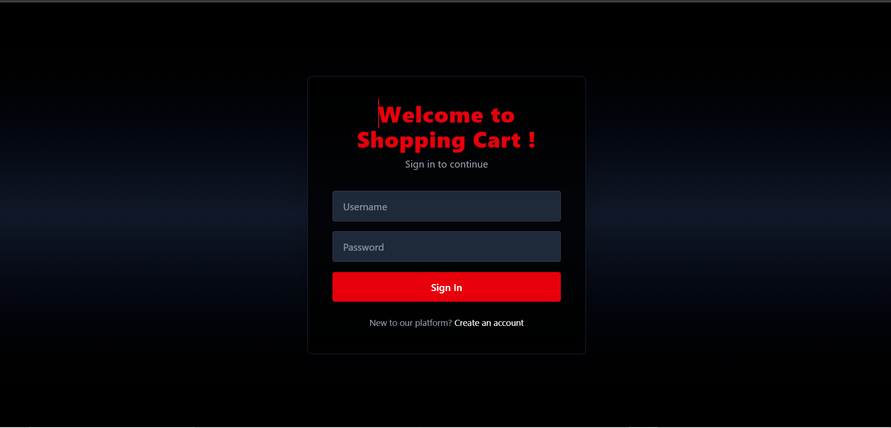
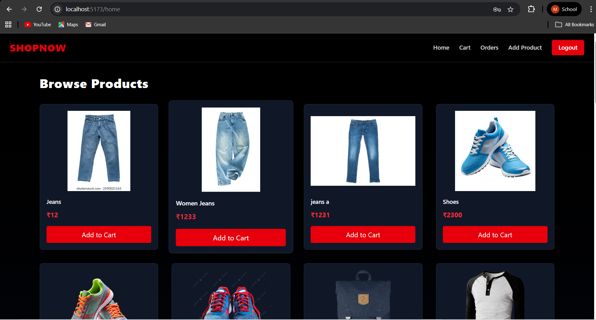
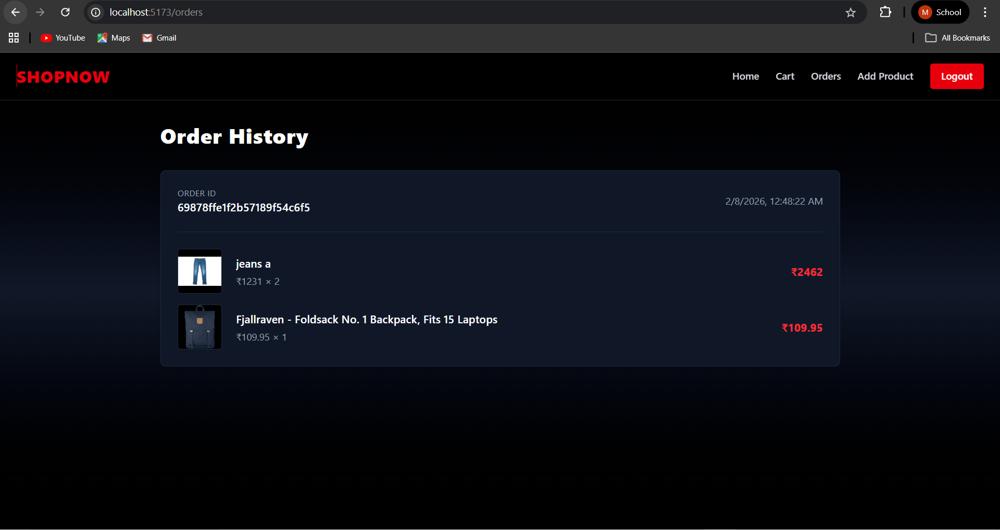
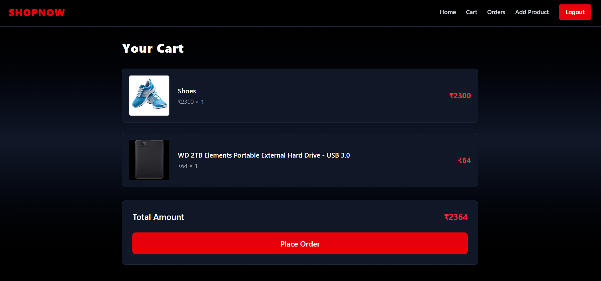
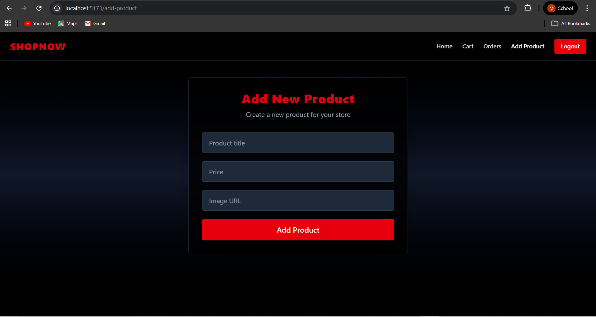

# 🛒 ABCDE-Ven._Assessment – Shopping Cart Application

A full-stack **Shopping Cart Web Application** developed as part of the **ABCDE Ventures Assessment**.  
This project demonstrates secure authentication, cart management, order handling, and a modern responsive UI.

---

## 🚀 Tech Stack

### Frontend
- React (Vite)
- React Router DOM
- Axios
- Tailwind CSS

### Backend
- Node.js
- Express.js
- MongoDB
- Mongoose
- JWT Authentication
- bcryptjs

---

## 📁 Project Structure

---

## ✨ Features

- User Signup & Login (JWT-based authentication)
- Single-device login restriction
- Protected routes
- Product listing
- Add to cart functionality
- Cart management
- Order placement
- Logout functionality
- Responsive and modern UI

---

## 📸 Application Screenshots

### 🔐 Login Page

---

### 🏠 Home Page

---

### 📦 Order Page

---

### 🛒 Cart Page

---

### ➕ Add Product Page

---

